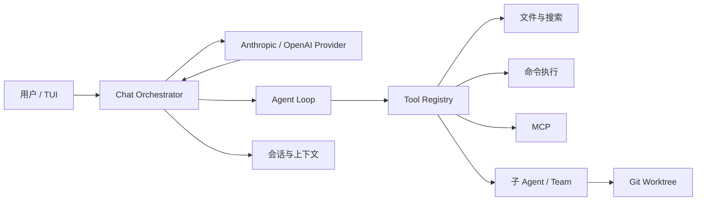

# LunaCode

LunaCode 是一个使用 Java 17 构建的终端 AI 编程助手。它在当前项目目录中与模型持续对话，并通过文件读写、代码搜索、命令执行、子 Agent、MCP、Git Worktree 和团队任务等能力完成真实的软件开发工作。

> 项目仍处于快速开发阶段。`src/main` 代表当前代码，`spec/` 记录各阶段的设计与验收标准；两者不一致时，请以实际入口装配和测试结果为准。

## 核心能力

- **终端对话**：基于 JLine 的 TUI，支持流式回复、工具调用展示、取消运行和多轮上下文。
- **模型接入**：支持 Anthropic 协议和 OpenAI 兼容协议，可配置模型、API 地址、密钥与 Thinking 参数。
- **代码操作**：内置 `ReadFile`、`WriteFile`、`EditFile`、`Glob`、`Grep` 和 `Bash` 等工具。
- **安全控制**：提供路径沙箱、敏感值脱敏、危险命令检查及多种权限模式。
- **会话与上下文**：会话以 JSONL 持久化，支持恢复、自动压缩和手动 `/compact`。
- **子 Agent**：支持内置、用户级、项目级和插件来源的 Agent 定义，可前台或后台运行。
- **并行协作**：通过 Git Worktree 隔离任务，并提供团队、共享任务和邮箱消息基础设施。
- **MCP**：支持 stdio 与 Streamable HTTP 两类 MCP Server，动态注册远程工具。

## 工作方式



应用入口是 `com.lunacode.app.Main`，主要装配位于 `LunaCodeApplication`。程序以启动时的当前目录作为工作区根目录，并将运行状态写入该项目的 `.lunacode/`。

## 环境要求

- JDK 17 或更高版本
- Maven
- Git（使用 Worktree 或团队隔离时必需）
- 可用的模型 API Key
- Linux 执行命令工具时需要 Bubblewrap（`bwrap`）；Windows 使用直接命令进程，并由 LunaCode 的权限与路径规则保护

## 快速开始

### 1. 创建配置

`config.example.yaml` 展示了完整配置。首次运行建议先创建一个最小的 `config.yaml`：

```yaml
protocol: anthropic
model: claude-sonnet-4-20250514
base_url: https://api.anthropic.com
api_key: ${ANTHROPIC_API_KEY}

thinking:
  enabled: true
  budget_tokens: 4096

permissions:
  mode: default
```

设置 API Key：

```powershell
# PowerShell
$env:ANTHROPIC_API_KEY = "your-api-key"
```

```bash
# Bash
export ANTHROPIC_API_KEY="your-api-key"
```

也可以将 `protocol` 改为 `openai`，并把 `base_url`、`model` 和 API Key 调整为对应的 OpenAI 兼容服务配置。

### 2. 构建并启动

```powershell
mvn package -DskipTests
java -jar target/lunacode-0.1.0-SNAPSHOT.jar config.yaml
```

不传参数时，程序默认读取当前目录的 `config.yaml`：

```powershell
java -jar target/lunacode-0.1.0-SNAPSHOT.jar
```

进入界面后直接输入开发任务即可，例如：

```text
阅读项目结构，找到用户登录接口，并为它补充边界测试。
```

## 配置说明

### Provider

| 配置项 | 说明 |
| --- | --- |
| `protocol` | 必填，支持 `anthropic` 或 `openai` |
| `model` | 必填，发送给 Provider 的模型名 |
| `base_url` | 必填，完整的 Provider API 基地址；具体接口路径由 LunaCode 拼接 |
| `api_key` | 必填，可直接填写或引用单个环境变量 |
| `thinking.enabled` | 是否启用扩展思考 |
| `thinking.budget_tokens` | 思考 token 预算 |

API Key 推荐写成环境变量引用。如果变量不存在或为空，LunaCode 会拒绝启动。不要把真实密钥提交到仓库。

### 权限模式

```yaml
permissions:
  mode: default
```

| 模式 | 行为 |
| --- | --- |
| `default` | 读取类操作通常自动允许，写入、命令和高风险操作按规则确认 |
| `acceptEdits` | 自动允许文件编辑，命令执行仍按默认策略处理 |
| `plan` | 只规划和分析，不执行修改 |
| `bypassPermissions` | 跳过常规权限确认；属于危险模式，启用时仍会要求显式确认 |

权限规则保存在 `.lunacode/permissions.yaml` 和 `.lunacode/permissions.local.yaml`。本地文件适合保存不希望提交的个人规则。

### 命令沙箱

```yaml
sandbox:
  network_enabled: false
  extra_roots:
    - name: shared-cache
      path: /tmp/lunacode-cache
```

工作区根目录始终是默认可访问根。`extra_roots` 用于显式开放额外路径，请只添加任务确实需要的目录。

### MCP Server

本地 stdio Server：

```yaml
mcp:
  servers:
    local_tools:
      command: node
      args: [tools/mcp-server.js]
      env:
        ACCESS_TOKEN: ${LOCAL_TOOL_TOKEN}
```

远程 Streamable HTTP Server：

```yaml
mcp:
  servers:
    remote_docs:
      url: https://example.com/mcp
      headers:
        Authorization: Bearer ${REMOTE_MCP_TOKEN}
```

MCP 配置按“用户级 `~/.lunacode/config.yaml` → 项目级配置”的顺序合并。同名 Server 由项目配置完整覆盖；无法解析或连接的 Server 会产生警告并被跳过。

### 上下文与实验特性

`context` 可调整上下文窗口、自动压缩边界、最近消息预算和大型工具结果限制，完整字段见 `config.example.yaml`。

```yaml
features:
  FORK_SUBAGENT: true
  COORDINATOR_MODE: false
```

Coordinator Mode 还要求环境变量 `LUNACODE_COORDINATOR_MODE` 为 truthy 才会生效，避免仅靠配置误开启。

## 斜杠命令

| 命令 | 用途 |
| --- | --- |
| `/help [command]` | 查看全部命令或某个命令的帮助 |
| `/status` | 查看 Agent 模式、权限、Provider、模型、token、会话和运行状态 |
| `/clear` | 清空终端可见输出 |
| `/compact` | 手动压缩当前上下文 |
| `/plan`、`/do` | 进入计划模式或返回执行模式 |
| `/permission [mode]` | 查看或切换权限模式 |
| `/session current/list/resume/new` | 查看、恢复或创建会话 |
| `/worktree create/list/enter/exit/remove` | 管理隔离 Worktree |
| `/team create/use/list/delete/member` | 管理 Agent Team |
| `/memory list/delete/on/off` | 管理项目记忆；依赖运行时记忆模块接线 |
| `/review [额外关注]` | 让 Agent 审查当前 `git diff` |
| `/cancel` | 取消当前运行或等待 |

命令支持别名和 Tab 补全，使用 `/help` 获取当前构建中最准确的命令列表。

## 项目结构

```text
src/main/java/com/lunacode/
├─ app/            程序入口与依赖装配
├─ tui/            Lanterna 终端界面
├─ orchestrator/   对话编排、斜杠命令与运行状态
├─ agent/          Agent 循环、单轮执行与工具调度
├─ provider/       Anthropic / OpenAI 请求适配
├─ stream/         SSE 和流式事件解析
├─ conversation/   对话消息与内容块模型
├─ prompt/         系统提示、环境上下文与消息通道
├─ tool/           内置工具、注册表与执行上下文
├─ permission/     权限规则、危险命令与路径沙箱
├─ session/        JSONL 会话持久化与恢复
├─ context/        token 估算、压缩与工具结果外置
├─ subagent/       子 Agent 定义、派生、运行与恢复
├─ background/     后台任务和前台 Agent 跟踪
├─ worktree/       Git Worktree 生命周期与成果保护
├─ team/           团队、成员、任务、邮箱和协作工具
├─ coordinator/    Coordinator Mode 判定与工具收窄
├─ mcp/            MCP 发现、传输、JSON-RPC 与工具包装
├─ command/        斜杠命令注册、解析、补全和分发
├─ config/         YAML 配置、环境变量与 feature gate
├─ skill/          Skill 发现、解析与调用策略
├─ memory/         项目记忆模型与命令处理
├─ hook/           工具事件 Hook 基础设施
└─ interaction/    Agent 向用户提问的交互通道

src/test/          单元测试与集成测试
src/main/resources/lunacode/skills/
                   内置 Skill 资源
spec/              分章节的 spec、plan、task 与 checklist
toolTest/          手工工具和 MCP 测试素材
SkillTest/         Skill 端到端测试素材
```

运行时数据：

```text
.lunacode/
├─ sessions/       当前项目的会话 JSONL
├─ teams/          团队、成员、任务和邮箱
├─ worktrees/      LunaCode 管理的隔离工作目录
├─ permissions.*  项目权限规则
├─ memory/         项目记忆
└─ tmp/            上下文和子 Agent 临时数据
```

## 当前实现边界

代码库包含 Hook、Memory、Skill、Team 和 Coordinator 等完整度不同的模块。当前默认入口已接入会话、上下文、MCP、子 Agent、Worktree 和 Team 的主要链路；以下部分仍应视为演进中能力：

- Hook 已有解析、执行基础设施和测试，但默认 `LunaCodeApplication` 仍使用 `NoOpHookRuntime`。
- Memory 和 Skill 具备独立模块及测试，部分主入口编排仍未完成接线，相关命令可能提示当前运行时不可用。
- Agent Team 的同进程协作、任务和消息基础设施已存在，终端窗格后端、完整审批/恢复流程与自动合并仍在完善。
- Coordinator Mode 是显式 opt-in 的实验能力，不应作为默认工作流依赖。
- `spec/` 中未勾选的 checklist 表示设计目标，不等同于已经验收的功能。

## 开发与验证

```powershell
# 运行全部测试
mvn test

# 构建可执行 fat JAR
mvn package -DskipTests

# 检查补丁空白问题
git diff --check
```

项目采用规格驱动的演进方式。开发一个章节时，应阅读对应的 `spec.md`、`plan.md`、`task.md` 和 `checklist.md`。

完成功能后，按 `AGENTS.md` 要求做端到端验收：

1. 在 tmux 中启动 LunaCode。
2. 输入一段会触发真实工具调用的对话请求。
3. 观察工具参数、权限确认、执行结果和最终回复。
4. 对照对应章节的 `checklist.md` 逐项验收。

Windows 默认不提供 tmux，可在 WSL 或 Linux 环境中执行这一步。

## 安全提示

- 不要提交 `config.yaml`、`.lunacode/permissions.local.yaml` 或包含真实密钥的文件。
- 只在可信仓库中使用 `bypassPermissions`。
- 开放网络或额外沙箱根目录前，先确认任务确实需要这些权限。
- 删除 Team 或 Worktree 前检查未提交修改和未合并分支；LunaCode 会尽量阻止静默丢失成果，但不能替代正常的 Git 提交与备份流程。

## 项目状态

LunaCode 当前更适合用于学习、实验和持续开发，还不是稳定发布的软件。若要判断某项能力是否可用于真实任务，请同时检查入口装配、对应测试和 `spec/<chapter>/checklist.md`。
