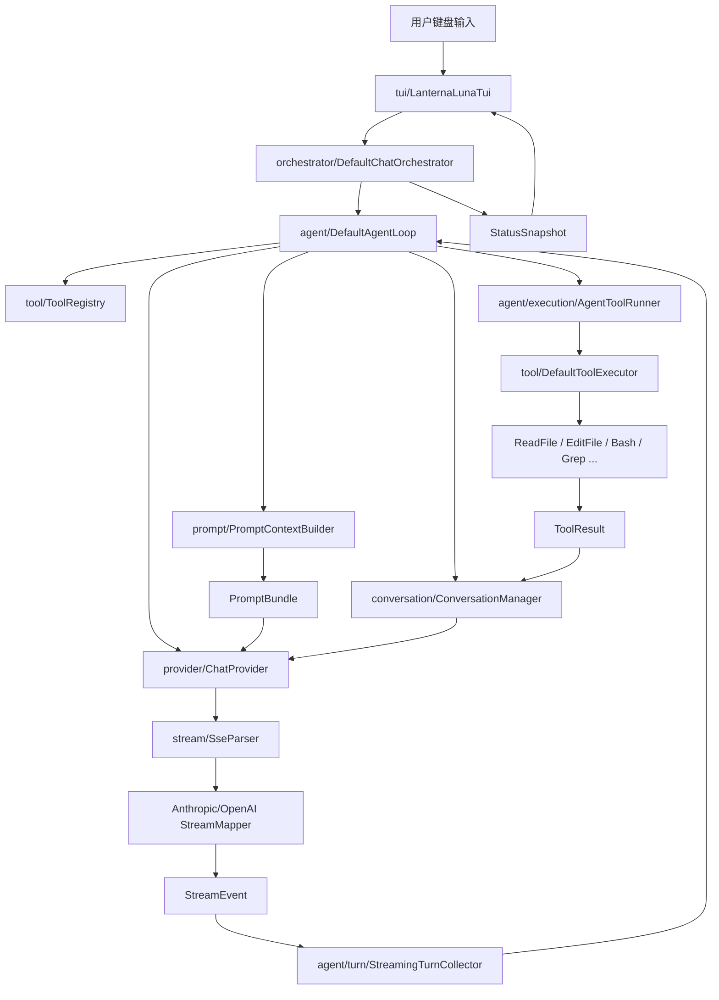

# LunaCode 01-04 阶段学习总结

本文用于快速学习 LunaCode 当前架构和源码。它不是新的需求文档，而是对 `spec/01` 到 `spec/04` 已完成设计方向和当前源码结构的阶段性导读。

## 一、项目现在是什么

LunaCode 是一个用 Java 实现的终端 AI 编程助手，形态类似 Claude Code：用户在终端里输入请求，LunaCode 将请求、项目上下文、工具声明和系统提示发送给模型；模型可以直接回复，也可以请求调用工具；LunaCode 执行工具后把结果回灌给模型，直到模型给出最终回答或触发停止条件。

当前项目已经具备这些核心能力：

| 能力 | 当前实现 |
| --- | --- |
| 终端交互 | 使用 JLine 构建 TUI 输入和流式输出界面 |
| 多轮对话 | `ConversationManager` 保存当前进程内的对话历史 |
| Provider 抽象 | 支持 OpenAI 与 Anthropic 两类协议 |
| SSE 流式响应 | 把 Provider 原始流事件统一映射为 `StreamEvent` |
| 工具系统 | 内置读文件、写文件、改文件、命令、Glob、Grep、用户澄清问题工具 |
| Agent Loop | 支持多轮“模型 -> 工具 -> 结果 -> 模型”的自动循环 |
| Plan Mode | 支持 `/plan` 规划与 `/do` 执行计划的两段式语义 |
| Prompt 分层 | 将静态提示、环境上下文、工具声明、系统提醒和历史消息拆开 |
| 缓存策略 | 对稳定 System Prompt 和工具声明预留缓存标记，并解析缓存用量字段 |

## 二、四个阶段分别解决了什么

### 01：TUI 对话内核

第一阶段把 LunaCode 做成一个可运行的终端聊天程序。它关注的是“能不能启动、能不能输入、模型能不能流式回复、状态能不能展示”。

关键成果：

- 建立 Maven + Java 17 项目。
- 通过 `config.yaml` 读取 Provider、模型、API Key、thinking 等配置。
- 抽象出 `ChatProvider`，让 TUI 不直接依赖 OpenAI 或 Anthropic。
- 建立 `ConversationManager`，维护内部消息和 API 消息之间的转换。
- 建立 `SseParser` 与 `StreamEvent`，把模型流式响应转换成内部统一事件。
- 建立 TUI，支持输入、流式显示、状态展示和多轮对话。

### 02：工具系统

第二阶段让模型从“只能说话”升级到“可以请求 LunaCode 做事”。模型可以请求读取文件、搜索代码、写入文件、修改文件或执行命令。

关键成果：

- 定义统一 `Tool` 接口：工具名称、描述、参数 Schema、执行逻辑。
- 建立 `ToolRegistry`，集中注册工具，并输出模型可理解的工具声明。
- 建立 `ToolExecutor`，统一完成工具查找、参数校验、异常包装和结果返回。
- 扩展流事件映射，识别 Anthropic / OpenAI 的工具调用。
- 把工具结果作为对话历史回灌给模型。

### 03：Agent Loop

第三阶段解决“一步工具调用不够用”的问题。以前模型调用一次工具后就停，现在 LunaCode 可以继续让模型根据工具结果决定下一步，形成多轮循环。

关键成果：

- 建立 `DefaultAgentLoop` 作为循环入口。
- 每一轮调用模型、收集流式文本和工具调用、执行工具、回灌结果。
- 用 `LoopDecisionMaker` 集中判断是否继续。
- 加入迭代上限、取消、连续未知工具等停止条件。
- 支持多个工具调用分批执行：安全只读工具可并发，有副作用工具串行。
- 引入 `/plan` 与 `/do` 的 Plan Mode 工作流。
- 引入 `AgentEvent`，让 Agent 内部事件和 TUI 状态展示解耦。

### 04：系统提示结构化与缓存策略

第四阶段让模型“更懂怎么干活”。它把原本混在一起的 System Prompt 拆成稳定提示、动态环境、工具声明、系统提醒、历史消息等不同通道。

关键成果：

- 静态 System Prompt 拆成七个模块：角色设定、行为准则、工具使用指南、代码质量规范、安全边界、任务执行模式、输出风格。
- `PromptBundle` 统一承载 prompt 的完整结构。
- `SystemChannel` 放静态提示和环境上下文。
- `MessageChannel` 放项目指令预留、记忆预留、System Reminder、历史消息。
- `AnthropicPromptAdapter` 和 `OpenAiPromptAdapter` 分别把 `PromptBundle` 映射到不同 Provider 请求体。
- 对稳定的静态提示和工具声明增加缓存意图。
- 扩展 `TokenUsage`，支持缓存读取 / 缓存创建等用量字段。

## 三、整体架构图



读图方式：

1. 用户输入先到 TUI。
2. TUI 把文本交给编排器。
3. 编排器启动后台 Agent Loop。
4. Agent Loop 每轮构造 Prompt，调用模型。
5. 模型流式返回文本或工具调用。
6. 如果有工具调用，LunaCode 执行工具，把结果加入对话历史。
7. Agent Loop 再次调用模型，直到模型不再请求工具。
8. TUI 通过状态快照和对话快照展示当前进度。

## 四、源码包职责速览

| 包 | 职责 | 建议先读的类 |
| --- | --- | --- |
| `app` | 程序入口和依赖装配 | `Main`、`LunaCodeApplication` |
| `tui` | 终端输入、流式打印、状态展示 | `LanternaLunaTui`、`InputLineBuffer` |
| `orchestrator` | 连接 TUI 与 Agent，管理后台任务和状态 | `DefaultChatOrchestrator`、`StatusSnapshot` |
| `agent` | Agent Loop 主流程和循环决策 | `DefaultAgentLoop`、`LoopDecisionMaker` |
| `agent.turn` | 单轮模型调用与流式收集 | `AgentTurnRunner`、`StreamingTurnCollector` |
| `agent.execution` | 工具批次执行 | `AgentToolRunner` |
| `conversation` | 对话历史、消息块、API 格式转换 | `DefaultConversationManager`、`ContentBlock` |
| `prompt` | System Prompt、环境上下文、Reminder、PromptBundle | `PromptContextBuilder`、`StaticSystemPromptBuilder` |
| `provider` | OpenAI / Anthropic 请求体构建和 HTTP 调用 | `OpenAiProvider`、`AnthropicProvider`、两个 PromptAdapter |
| `stream` | SSE 解析和 Provider 流事件映射 | `SseParser`、`OpenAiStreamMapper`、`AnthropicStreamMapper` |
| `tool` | 工具抽象、注册、权限、执行、具体工具 | `Tool`、`DefaultToolRegistry`、`DefaultToolExecutor` |
| `interaction` | 阻塞式用户确认和需求澄清通道 | `BlockingUserQuestionBroker`、`BlockingPermissionConfirmationBroker` |
| `config` | YAML 配置读取和模型配置 | `ConfigLoader`、`ProviderConfig`、`AgentConfig` |
| `runtime` | 运行模式、取消信号、Agent 运行配置 | `AgentMode`、`AgentRunConfig`、`CancellationToken` |

## 五、一次用户请求的完整链路

### 1. 启动阶段

入口是 `com.lunacode.app.Main`。它只做一件事：创建 `LunaCodeApplication` 并运行。

`LunaCodeApplication` 负责装配运行时依赖：

- 读取 `config.yaml`。
- 根据 `protocol` 创建 `OpenAiProvider` 或 `AnthropicProvider`。
- 创建 `DefaultConversationManager`。
- 创建工作区路径解析器 `WorkspacePathResolver`。
- 注册内置工具。
- 创建 `DefaultToolExecutor`。
- 创建 `DefaultChatOrchestrator`。
- 创建并启动 `LanternaLunaTui`。

这相当于项目的“手动依赖注入容器”。当前没有使用 Spring 这类框架，所有对象关系都在这里显式拼起来，方便学习和调试。

### 2. 用户输入进入编排器

用户在 TUI 中按回车后，`LanternaLunaTui` 调用：

```text
DefaultChatOrchestrator.submitUserMessage(content)
```

编排器会先处理几个特殊情况：

- 当前是否正在等待权限确认。
- 当前是否正在等待用户回答 Plan Mode 的澄清问题。
- 用户是否输入了 `/cancel`。
- 当前是否已经有一个请求正在运行。
- 用户是否输入了 `/plan` 或 `/do`。

然后它创建 `AgentRequest`，在线程池中异步启动 `DefaultAgentLoop.run(...)`。

### 3. Agent Loop 每轮怎么跑

`DefaultAgentLoop` 是核心循环。每一轮大致做这些事：

1. 检查是否取消。
2. 用 `PromptContextBuilder` 构造本轮 `PromptBundle`。
3. 从 `ConversationManager` 获取 API 格式历史消息。
4. 从 `ToolRegistry` 获取工具声明。
5. 调用 `AgentTurnRunner.runTurn(...)`。
6. `AgentTurnRunner` 调用 Provider 的流式接口。
7. `StreamingTurnCollector` 收集流事件：
   - 文本增量追加到 assistant 消息。
   - 工具调用记录为 `ToolUse`。
   - Token 用量合并。
   - 错误转为失败状态。
8. `LoopDecisionMaker` 判断下一步：
   - 没有工具调用：完成。
   - 有工具调用：执行工具后继续下一轮。
   - 达到迭代上限：停止。
   - 连续未知工具太多：停止。
   - 模型或流式失败：停止。

### 4. 工具调用怎么执行

模型返回工具调用后，`AgentToolRunner` 负责执行。它不会直接逐个工具盲目调用，而是先交给 `ToolBatchPlanner` 分批。

分批原则：

- 只读、非破坏、并发安全的工具可以放在同一批并发执行，例如 `ReadFile`、`Glob`、`Grep`。
- 写文件、改文件、命令执行、用户提问等工具串行执行。

每个工具执行前还会经过 `DefaultToolPermissionGateway`：

- 只读工具默认允许。
- `AskUserQuestion` 只在 Plan Mode 允许。
- Plan Mode 写入指定 plan file 允许。
- `Bash` 或破坏性工具需要用户确认。

执行结果被包装成 `ToolExecutionRecord`，再转换成 `ContentBlock.ToolResultBlock` 加回对话历史。下一轮模型就能看到工具结果，并继续推理。

### 5. 模型回复怎么显示到终端

Provider 返回的是 SSE 流。LunaCode 的处理分三层：

1. `SseParser` 把原始 `event:` / `data:` 行解析成 `SseEvent`。
2. `OpenAiStreamMapper` 或 `AnthropicStreamMapper` 把不同厂商事件转换成统一 `StreamEvent`。
3. `StreamingTurnCollector` 根据 `StreamEvent` 更新对话消息，并通过 `AgentEvent` 通知编排器。

TUI 本身不理解 OpenAI 或 Anthropic 的原始格式，只看 `ConversationManager.snapshot()` 和 `StatusSnapshot`。这就是解耦：界面只关心“当前有哪些消息、当前状态是什么”，不关心底层模型协议。

## 六、复杂名词解释

### TUI

TUI 是 Text User Interface，即终端用户界面。它不是普通 `System.out.println` 的逐行程序，而是能监听键盘、刷新状态、控制光标和动态显示输出的终端界面。

本项目里主要实现是 `LanternaLunaTui`。虽然类名里有 Lanterna，但当前代码使用的是 JLine。

### Provider

Provider 指模型供应商或模型协议适配层。例如 OpenAI 和 Anthropic 的 API 格式、鉴权头、工具调用格式、流式事件格式都不同。LunaCode 用 `ChatProvider` 把它们统一成一个接口。

好处是：Agent Loop 不需要知道“这是 OpenAI 还是 Claude”，只要调用 `streamChat(...)`。

### SSE

SSE 是 Server-Sent Events，服务端持续向客户端推送事件的一种 HTTP 流式格式。模型流式输出时，服务端会一行一行发送类似 `event:`、`data:` 的内容。

LunaCode 用 `SseParser` 把原始文本行解析成 `SseEvent`。

### StreamEvent

`StreamEvent` 是 LunaCode 内部统一的流式事件模型。OpenAI 和 Anthropic 的原始事件不同，但最终都会转换成这些内部事件：

- `MessageStart`：模型消息开始。
- `ContentDelta`：文本增量。
- `ToolUse`：模型请求调用工具。
- `MessageDelta`：消息级别变化，例如 stop reason 或 usage。
- `MessageStop`：模型消息结束。
- `Error`：流式响应失败。

### Agent Loop

Agent Loop 是 LunaCode 自动工作的循环。它不是只问模型一次，而是反复执行：

```text
模型输出 -> 发现工具调用 -> 执行工具 -> 把工具结果给模型 -> 模型继续输出
```

直到模型不再需要工具，或者触发停止条件。

### ReAct

ReAct 是 Reason + Act 的缩写，意思是模型一边推理，一边采取行动。对应到 LunaCode，就是模型根据上下文决定要不要调用工具，工具结果回来后再继续推理。

### Tool Use

Tool Use 指模型不是直接回答，而是返回一个结构化工具调用，例如“读取 `pom.xml`”。LunaCode 收到后执行本地工具，再把结果回传给模型。

### JSON Schema

JSON Schema 是描述 JSON 参数结构的规范。每个工具都会声明自己需要哪些参数，例如 `ReadFile` 需要 `path`，`EditFile` 需要 `path`、`old_text`、`new_text`。模型拿到 Schema 后更容易生成正确参数。

### PromptBundle

`PromptBundle` 是第四阶段引入的提示上下文总包。它把一次模型请求需要的内容分成几类：

- `SystemChannel`：静态系统提示 + 动态环境上下文。
- `toolDeclarations`：工具声明。
- `MessageChannel`：项目指令预留、记忆预留、System Reminder、历史消息。
- `PromptCachePolicy`：哪些稳定内容希望启用缓存。

### System Prompt

System Prompt 是给模型的最高优先级指令，描述模型身份、行为规则、安全边界和输出风格。当前静态 System Prompt 由 `StaticSystemPromptBuilder` 生成，分成七个固定模块。

### System Reminder

System Reminder 是运行时动态补充指令。例如 Plan Mode 的“当前处于规划模式，避免实际修改”就不适合写死进静态 System Prompt，而是作为 reminder 按轮次注入。

### Adapter

Adapter 是适配器。`AnthropicPromptAdapter` 和 `OpenAiPromptAdapter` 都是在做同一件事：把 LunaCode 内部的 `PromptBundle` 转换成对应 Provider 要求的 JSON 请求体。

### Snapshot

Snapshot 是快照。`ConversationManager.snapshot()` 返回当前消息列表的不可变副本，TUI 用它渲染界面。这样 TUI 不会直接拿到内部可变对象，也不容易和流式更新发生并发冲突。

### TokenUsage 和 CacheUsage

`TokenUsage` 保存输入 token、输出 token、总 token，以及缓存相关 token。缓存字段用于观察 Provider 是否复用了稳定提示内容。不同 Provider 返回字段不同，所以代码里允许未知或部分统计。

### Plan Mode

Plan Mode 是规划模式。用户输入 `/plan xxx` 后，LunaCode 会要求模型先澄清需求、探索代码、写计划，避免直接修改业务文件。用户再输入 `/do` 后，进入执行语境。

Plan Mode 不是简单“禁止一切写操作”。当前设计是：写指定 plan file 自动允许，其他写入或命令仍走权限确认。

### Permission Gateway

Permission Gateway 是权限决策层。它根据工具类型、当前模式、目标文件等信息决定工具调用是：

- `ALLOW`：直接执行。
- `ASK`：需要用户确认。
- `DENY`：拒绝。

### Broker

Broker 是“中间通道”。例如 `BlockingUserQuestionBroker` 用来让 `AskUserQuestion` 工具暂停等待用户回答；`BlockingPermissionConfirmationBroker` 用来等待用户确认工具权限。

## 七、关键数据模型

### InternalMessage 与 ApiMessage

`InternalMessage` 是 LunaCode 内部和 TUI 使用的消息模型，包含：

- 消息 ID。
- 角色。
- 状态。
- 时间。
- token 用量。
- 文本内容。
- 错误摘要。

`ApiMessage` 是发给模型 API 的简化消息模型，只保留 role 和 content block。这样可以避免把 UI 状态、时间戳、内部 ID 泄露给模型。

### ContentBlock

`ContentBlock` 表示一条消息里的结构化内容块：

- `Text`：普通文本。
- `ToolUseBlock`：assistant 消息中的工具调用。
- `ToolResultBlock`：tool/user 消息中的工具结果。

这个设计让 Anthropic 这类支持结构化 content block 的 Provider 可以保留工具调用 ID 和结果对应关系。

### ToolResult

`ToolResult` 是工具执行结果：

- `content`：给模型看的结果正文。
- `isError`：是否失败。
- `metadata`：结构化元信息，例如错误类型、耗时、是否截断、文件路径等。

工具失败不会让进程直接崩溃，而是作为结构化结果回灌给模型，让模型有机会修正下一步。

## 八、Prompt 分层为什么重要

第四阶段最值得学习的是“稳定内容”和“动态内容”的分离。

稳定内容包括：

- LunaCode 的角色和工作原则。
- 工具使用规则。
- 代码质量规则。
- 安全边界。
- 输出风格。
- 工具名称、描述、参数 Schema。

动态内容包括：

- 当前工作目录。
- 当前时间。
- Git 状态。
- 当前模式。
- 当前轮次。
- 用户历史对话。
- 工具结果。

如果把所有内容都塞到一个大字符串里，会有几个问题：

1. 每轮提示都变化，模型 API 很难缓存稳定部分。
2. Plan Mode 的临时约束可能残留到 Default 模式。
3. 后续接入项目指令、记忆或 MCP 时边界会混乱。
4. 测试很难断言“某类上下文应该出现在哪里”。

所以现在的做法是：

- 静态规则进入 `StaticSystemPrompt`。
- 环境信息进入 `EnvironmentContext`。
- 工具声明进入 `tools`。
- Plan Mode 等动态提醒进入 `SystemReminder`。
- 对话历史保持在 `messages`。

## 九、内置工具学习表

| 工具 | 作用 | 风险级别 | 关键实现点 |
| --- | --- | --- | --- |
| `ReadFile` | 读取工作区文本文件 | 只读 | 返回带行号内容，支持 `offset` / `limit` |
| `WriteFile` | 写入完整文件 | 破坏性 | 创建父目录，临时文件写入后移动替换 |
| `EditFile` | 唯一匹配替换 | 破坏性 | `old_text` 必须只出现一次，否则不修改 |
| `Bash` | 执行非交互命令 | 破坏性 | 有超时、退出码、stdout/stderr、输出截断 |
| `Glob` | 按文件模式查找 | 只读 | 支持 `**` 递归匹配，返回相对路径 |
| `Grep` | 搜索文本内容 | 只读 | 跳过 `.git/`、`target/` 和二进制文件 |
| `AskUserQuestion` | Plan Mode 澄清需求 | 交互 | 通过 broker 等待用户回答 |

所有文件类工具都通过 `WorkspacePathResolver` 限制在工作区内，避免模型读写工作区外路径。

## 十、停止条件与安全边界

Agent Loop 需要停止，否则模型可能一直请求工具。当前停止条件主要在 `LoopDecisionMaker` 中：

- 用户取消。
- 当前轮模型失败。
- 达到最大迭代次数。
- 连续未知工具次数达到阈值。
- 当前轮没有工具调用，说明模型给出了最终回复。

安全边界分布在多个位置：

- `WorkspacePathResolver`：路径必须在工作区内。
- `DefaultToolPermissionGateway`：决定工具是否允许、询问或拒绝。
- `SensitiveValueMasker`：工具输出中屏蔽已知敏感值。
- `ToolBatchPlanner`：只让安全只读工具并发。
- `ConfigLoader`：配置错误不泄露 API Key。
- `StaticSystemPromptBuilder`：提示模型不要越权、不要编造、修改前先读。

## 十一、源码阅读建议

如果你是第一次读这个项目，可以按这个顺序：

1. `src/main/java/com/lunacode/app/LunaCodeApplication.java`
   - 先看对象是怎么装配起来的。

2. `src/main/java/com/lunacode/orchestrator/DefaultChatOrchestrator.java`
   - 看用户输入如何变成后台 Agent 请求。

3. `src/main/java/com/lunacode/agent/DefaultAgentLoop.java`
   - 看主循环如何调用模型、执行工具、继续下一轮。

4. `src/main/java/com/lunacode/agent/turn/StreamingTurnCollector.java`
   - 看模型流式事件如何变成消息和工具调用。

5. `src/main/java/com/lunacode/tool/DefaultToolExecutor.java`
   - 看工具如何校验、执行和包装错误。

6. `src/main/java/com/lunacode/tool/ReadFileTool.java` 与 `EditFileTool.java`
   - 一个代表只读工具，一个代表破坏性修改工具。

7. `src/main/java/com/lunacode/prompt/PromptContextBuilder.java`
   - 看每一轮 PromptBundle 怎样构造。

8. `src/main/java/com/lunacode/provider/AnthropicPromptAdapter.java`
   - 看内部 PromptBundle 如何落到真实请求体。

9. `src/main/java/com/lunacode/stream/AnthropicStreamMapper.java`
   - 看工具调用的流式 JSON 参数怎样拼接。

10. `src/main/java/com/lunacode/tui/LanternaLunaTui.java`
    - 最后看界面层，因为它更多是输入输出细节。

## 十二、测试体系怎么帮助理解

测试目录本身也是学习地图：

- `conversation` 测试：理解消息状态、快照、API 格式转换。
- `stream` 测试：理解 SSE 和 Provider 事件映射。
- `tool` 测试：理解每个工具的边界、失败情况和权限策略。
- `agent` 测试：理解循环决策、工具执行、轮次收集。
- `prompt` 测试：理解静态提示、环境上下文、System Reminder、Plan Mode 注入。
- `provider` 测试：理解 OpenAI / Anthropic 请求体差异。
- `architecture` 测试：限制 `provider`、`tool`、`prompt` 不依赖 `agent` 包，避免底层模块反向依赖上层流程。

常用验证命令：

```powershell
mvn test
mvn package -DskipTests
java -jar target\lunacode-0.1.0-SNAPSHOT.jar
```

项目也提供了：

- `build-LunaCode.bat`
- `run-LunaCode.bat`

## 十三、当前架构的几个重要取舍

### 1. 不引入框架，保持可读性

当前没有 Spring、Guice 等依赖注入框架。对象装配集中在 `LunaCodeApplication`，虽然手写略长，但对学习源码很友好。

### 2. Provider 与 Agent 解耦

Agent Loop 只处理内部统一事件，不直接读 OpenAI 或 Anthropic 原始 JSON。这样以后新增 Provider 时，主要新增 Provider 和 StreamMapper，不必重写 Agent Loop。

### 3. 工具失败也是正常上下文

工具失败不会直接中断整个 Agent。很多失败会被包装成工具结果回灌给模型，例如匹配不到、参数错误、未知工具。模型可以根据失败信息修正下一步。

### 4. 权限是运行时策略，不是只靠 Prompt

Prompt 会提醒模型遵守边界，但真正的执行仍由 `WorkspacePathResolver` 和 `DefaultToolPermissionGateway` 把关。模型不听话时，系统仍能要求确认或拒绝。

### 5. Prompt 分层为后续扩展做准备

项目指令文件、自动记忆、MCP 等能力当前还只是预留，但 Prompt 结构已经给它们留了位置。后续新增时不需要把所有内容继续塞进一个大 System Prompt。

## 十四、后续学习时可以重点观察的问题

- `DefaultConversationManager.toAPIFormat()` 如何保证发给模型的历史格式合理。
- OpenAI 的工具调用和 Anthropic 的工具调用为什么需要不同的缓冲逻辑。
- `ToolBatchPlanner` 为什么只并发只读工具。
- Plan Mode 为什么不直接禁止所有写入，而是让权限系统继续决定。
- `PromptBundle` 里的稳定内容和动态内容如何影响缓存命中。
- TUI 为什么只依赖快照和状态，而不直接操作 Agent 内部对象。

## 十五、一句话总结

LunaCode 当前已经从“终端流式聊天程序”演进成“带工具、带循环、带规划模式、带结构化 Prompt 的本地 Agent 雏形”。理解它的关键不是从某一个工具开始，而是先抓住这条主线：

```text
用户输入 -> 编排器 -> Agent Loop -> PromptBundle -> Provider 流式事件 -> 工具执行 -> 对话历史回灌 -> 下一轮模型调用 -> TUI 展示
```

顺着这条线读源码，整个项目会清楚很多。
