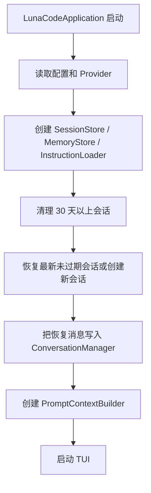
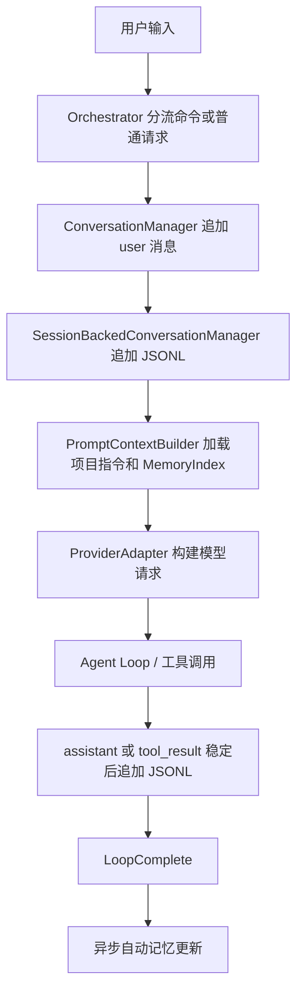
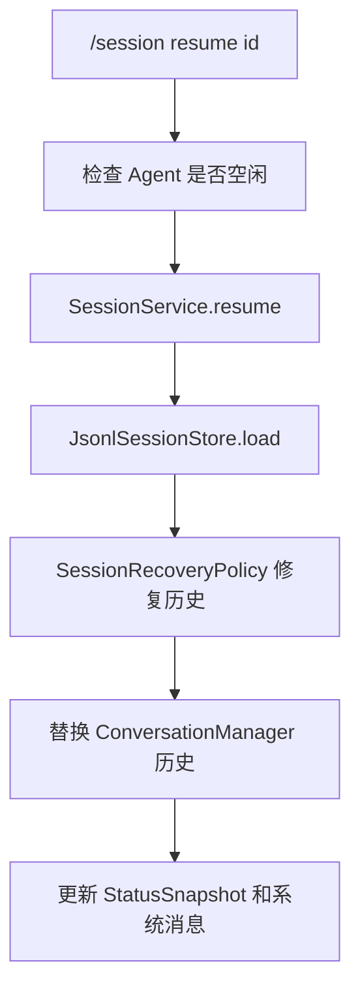

# LunaCode 项目记忆与会话恢复 Plan

## 架构概览

本章在现有 Agent Loop、ConversationManager、Prompt 构建和 TUI 之上增加四层能力：

1. **启动恢复层**：应用启动时加载项目指令、清理过期会话、恢复当前项目最近一个未过期会话，并在需要时插入时间跨度提醒。
2. **会话持久化层**：把正式会话追加写入 `<项目根>/.lunacode/sessions/*.jsonl`，恢复时扫 JSONL 得出会话信息，不维护额外 meta 文件。
3. **上下文注入层**：在处理请求前把项目指令、记忆索引、恢复后的会话历史按固定顺序放入模型上下文。
4. **自动记忆层**：每轮 Agent Loop 自然结束后异步回顾本轮增量，对用户级或项目级记忆执行 add/update/delete/no-op，并重建 MemoryIndex。

现有 `.lunacode/tmp/context` 仍然只承担长工具结果外置和压缩会话的临时上下文用途；正式会话存档独立放在 `.lunacode/sessions`。

## 核心数据结构

### 会话

```java
record SessionId(String value) {}

record SessionRecord(
    String role,
    Object content,
    Instant ts
) {}

record SessionInfo(
    String id,
    Path path,
    String title,
    int messageCount,
    Instant createdAt,
    Instant lastActiveAt,
    boolean expired
) {}

record SessionRecoveryResult(
    String sessionId,
    List<ConversationMessageSnapshot> messages,
    List<String> warnings,
    Optional<ConversationMessageSnapshot> timeGapReminder,
    boolean compacted,
    boolean summaryOnly
) {}
```

`SessionRecord.content` 序列化时支持字符串或 content block 数组，反序列化后转换为 `ConversationMessageSnapshot` 中已有的 `ContentBlock.Text`、`ContentBlock.ToolUseBlock`、`ContentBlock.ToolResultBlock`。

### 项目指令

```java
record InstructionSource(
    Path path,
    InstructionScope scope,
    int priority
) {}

enum InstructionScope {
    PROJECT_ROOT,
    PROJECT_LOCAL,
    USER
}

record InstructionSection(
    InstructionSource source,
    String content
) {}

record ProjectInstructionContext(
    List<InstructionSection> sections
) {}
```

加载顺序固定为：

1. `<项目根>/LUNACODE.md`
2. `<项目根>/.lunacode/LUNACODE.md`
3. `~/.lunacode/LUNACODE.md`

拼接时保持高优先级在前，并给每段加来源标题，便于模型理解优先级。

### 记忆

```java
enum MemoryType {
    USER_PREFERENCE,
    CORRECTION_FEEDBACK,
    PROJECT_KNOWLEDGE,
    REFERENCE_INFO
}

record MemoryNote(
    String id,
    MemoryType type,
    String title,
    Instant createdAt,
    Instant updatedAt,
    String sourceSession,
    String body,
    Path path
) {}

record MemoryIndexSnapshot(
    String userIndex,
    String projectIndex,
    String mergedContent,
    int lineCount,
    int byteCount
) {}

record MemoryConfig(
    boolean autoUpdate
) {}

record MemoryRuntimeState(
    boolean autoUpdateEnabled,
    String latestState
) {}

record MemoryUpdateRequest(
    String sessionId,
    List<ConversationMessageSnapshot> turnDelta,
    MemoryIndexSnapshot currentIndex,
    Instant completedAt
) {}

record MemoryUpdateAction(
    ActionKind kind,
    MemoryType type,
    Optional<String> targetId,
    Optional<String> title,
    Optional<String> body
) {}
```

`MemoryType` 决定落盘目录：

- `USER_PREFERENCE`、`CORRECTION_FEEDBACK` 写入 `~/.lunacode/memory/`
- `PROJECT_KNOWLEDGE`、`REFERENCE_INFO` 写入 `<项目根>/.lunacode/memory/`

每个目录各自维护一份 `MemoryIndex.md`。注入上下文时合并两份索引，整体限制为 200 行 / 25KB。

### 状态栏

现有 `StatusSnapshot` 增加字段：

```java
Optional<String> sessionShortId;
Optional<Boolean> memoryAutoUpdateEnabled;
Optional<String> memoryLatestState;
```

TUI 在等待状态、工具状态和空闲状态中都可以展示当前会话短 ID、自动记忆开关和最近一次记忆更新状态。

## 模块设计

### `com.lunacode.session`

新增正式会话模块。

核心接口：

```java
interface SessionStore {
    SessionId createSessionId();
    Path pathFor(SessionId id);
    void append(SessionId id, ConversationMessageSnapshot message);
    SessionLoadResult load(SessionId id);
    List<SessionInfo> listSessions();
    List<SessionInfo> deleteExpired(Duration ttl);
}

interface SessionService {
    SessionRecoveryResult restoreLatestOrCreate();
    SessionRecoveryResult resume(SessionId id);
    SessionId newSession();
    SessionInfo currentSession();
    List<SessionInfo> listSessions();
    void appendCurrent(ConversationMessageSnapshot message);
}
```

实现类：

- `JsonlSessionStore`：负责 JSONL 追加写、逐行读取、坏行跳过、扫描会话信息。
- `SessionRecoveryPolicy`：负责坏行 warning、未配对工具调用截断、24 小时时间跨度提醒、token 超限压缩一次。
- `SessionTitleDeriver`：从第一条 user 消息截断生成标题。
- `SessionBackedConversationManager`：包装现有 `DefaultConversationManager`，在 user 消息、assistant 完成消息、tool result 消息稳定后追加写当前会话。

会话 ID 用 `yyyyMMdd-HHmmss-xxxx`，随机后缀使用 4 位十六进制。同秒冲突时重新生成。

恢复策略：

1. 启动时先清理 30 天以上会话文件，并发出可见事件。
2. 选择最新未过期会话；没有则创建新会话。
3. 读取 JSONL，坏行跳过并记录 warning。
4. 如果尾部存在未配对 `tool_use`，从包含该 `tool_use` 的 assistant 消息开始截断。
5. 如果 last active 距当前时间超过 24 小时，追加一条内部提醒消息，提醒 Agent 上次活跃时间和可能的代码变更。
6. 估算恢复历史 token，如果超限，复用现有压缩能力尝试压缩一次。
7. 压缩失败时不改写 JSONL，不阻塞启动，只注入 session-summary/warning hint。

### `com.lunacode.instructions`

新增项目指令加载模块。

核心接口：

```java
interface ProjectInstructionLoader {
    ProjectInstructionContext load(Path projectRoot, Path userHome);
}

interface IncludeResolver {
    String expand(Path sourceFile, IncludeBoundary boundary, int depth, Set<Path> visited);
}
```

实现规则：

- 逐行扫描内容，遇到独占一行或行内 `@include <path>` 时解析路径并替换为被引用内容。
- 最大嵌套深度为 5。
- 用绝对规范路径 `visited` 防环路，遇到重复路径直接跳过。
- 项目级文件只能 include 项目根目录内文件。
- 用户级文件只能 include `~/.lunacode/` 内文件。
- 不支持 glob。
- include 失败、越界、超深度时保留一条短 warning 注释，不抛异常中断启动。

### `com.lunacode.memory`

新增记忆模块。

核心接口：

```java
interface MemoryStore {
    List<MemoryNote> listAll();
    Optional<MemoryNote> find(String id);
    MemoryNote upsert(MemoryUpdateAction action, String sourceSession);
    boolean delete(String id);
    MemoryIndexSnapshot rebuildIndexes();
    MemoryIndexSnapshot loadIndexes();
}

interface MemoryContextLoader {
    MemoryIndexSnapshot loadForPrompt();
}

interface AutoMemoryUpdater {
    void updateAsync(MemoryUpdateRequest request);
}

interface MemoryModelClient {
    List<MemoryUpdateAction> proposeUpdates(MemoryUpdateRequest request);
}
```

实现类：

- `MarkdownMemoryStore`：解析和写入带 frontmatter 的 Markdown 文件。
- `MemoryIndexBuilder`：按类型和更新时间生成用户级、项目级 `MemoryIndex.md`，强制 200 行 / 25KB 限制。
- `ProviderMemoryModelClient`：复用当前 Provider 配置异步调用 LLM，让模型输出结构化 add/update/delete/no-op。
- `DefaultAutoMemoryUpdater`：在后台线程执行更新，捕获失败并发出轻量状态，不影响用户回复。
- `MemoryCommandHandler`：处理 `/memory`、`/memory list`、`/memory delete <id>`、`/memory on`、`/memory off`。

记忆更新输入只包含：

- 本轮新增消息增量。
- 当前合并后的 `MemoryIndex.md`。
- 当前会话 ID 和完成时间。

不把完整历史会话发给记忆模型。

敏感信息过滤在写入前执行：明显的 token、密钥、密码、私钥内容不落盘；无法确定时倾向于不记。

### Prompt 构建

现有 `MessageChannel` 已有 `projectInstructions` 和 `memory` 字段，本章补齐它们的生产和渲染。

调整点：

- `PromptContextBuilder` 注入 `ProjectInstructionLoader` 和 `MemoryContextLoader`。
- `MessageChannelBuilder` 接收加载结果，构造完整 `MessageChannel`。
- `OpenAiPromptAdapter`、`AnthropicPromptAdapter` 按顺序渲染：
  1. 静态系统提示
  2. 环境信息
  3. 项目指令
  4. 记忆索引
  5. 恢复提醒 / 时间跨度提醒
  6. 会话历史

OpenAI 侧使用 system/developer 风格消息；Anthropic 侧使用 system 内容块加必要的 user reminder，保持与现有适配器风格一致。

### Orchestrator 和命令

`DefaultChatOrchestrator` 当前已内联处理 `/compact`、`/permissions`、`/plan`、`/do` 等命令。本章不引入大型命令框架，只新增小型 handler 并由 orchestrator 分发：

- `SessionCommandHandler`
- `MemoryCommandHandler`

行为约束：

- `/session current`：显示当前会话 ID、标题、消息数、最后活跃时间。
- `/session list`：按最后活跃时间倒序列出历史会话。
- `/session resume <id>`：切换并恢复指定会话。
- `/session new`：创建新会话并清空当前对话历史。
- `/memory`：展示索引摘要和自动记忆状态。
- `/memory list`：列出记忆。
- `/memory delete <id>`：删除记忆并重建索引。
- `/memory on|off`：只影响当前运行时开关；默认值来自配置。

切换会话时，如果 Agent 正在运行、等待权限确认或等待提问输入，命令返回提示，不执行切换。

### Agent Loop 完成钩子

`DefaultAgentLoop` 已在无后续工具调用时发出 `AgentEvent.LoopComplete`。Orchestrator 监听该事件后：

1. 更新状态为 idle。
2. 根据本轮起始消息位置截取 `turnDelta`。
3. 如果自动记忆开启，提交 `AutoMemoryUpdater.updateAsync(...)`。
4. 记忆更新完成后发出状态事件，更新 TUI 状态栏。

记忆线程与 Agent 主执行线程分离，避免记忆调用阻塞用户下一轮输入。

### 配置

扩展配置模型：

```yaml
memory:
  auto_update: true
```

调整点：

- `ProviderConfig` 增加 `MemoryConfig memory`。
- `ConfigLoader.RawConfig` 增加 `RawMemoryConfig`。
- 缺省值为 `true`。
- 运行时 `/memory off` 不写回配置文件，只改当前进程状态。

### TUI

`LanternaLunaTui` 基于扩展后的 `StatusSnapshot` 展示：

- 当前状态：idle / waiting / tool / error / warning。
- 当前会话短 ID：例如 `143000-a3f7` 或完整 ID 的后 11 位。
- 记忆状态：`memory:on` / `memory:off`。
- 最近一次更新：`memory:updated` / `memory:noop` / `memory:failed`。

启动清理过期会话、恢复会话、压缩失败降级等通过现有系统消息或新增轻量 `AgentEvent` 显示给用户。

## 模块交互

### 启动流程



### 用户请求流程



### 手动恢复流程



## 文件组织

计划新增或调整以下文件：

```text
src/main/java/com/lunacode/session/
  SessionId.java
  SessionRecord.java
  SessionInfo.java
  SessionLoadResult.java
  SessionRecoveryResult.java
  SessionStore.java
  JsonlSessionStore.java
  SessionService.java
  DefaultSessionService.java
  SessionRecoveryPolicy.java
  SessionTitleDeriver.java
  SessionBackedConversationManager.java
  SessionCommandHandler.java

src/main/java/com/lunacode/instructions/
  InstructionScope.java
  InstructionSource.java
  InstructionSection.java
  ProjectInstructionContext.java
  ProjectInstructionLoader.java
  DefaultProjectInstructionLoader.java
  IncludeResolver.java
  IncludeBoundary.java

src/main/java/com/lunacode/memory/
  MemoryType.java
  MemoryConfig.java
  MemoryNote.java
  MemoryIndexSnapshot.java
  MemoryRuntimeState.java
  MemoryStore.java
  MarkdownMemoryStore.java
  MemoryIndexBuilder.java
  MemoryContextLoader.java
  DefaultMemoryContextLoader.java
  AutoMemoryUpdater.java
  DefaultAutoMemoryUpdater.java
  MemoryModelClient.java
  ProviderMemoryModelClient.java
  MemoryUpdateRequest.java
  MemoryUpdateAction.java
  MemoryCommandHandler.java

src/main/java/com/lunacode/config/
  ProviderConfig.java
  ConfigLoader.java

src/main/java/com/lunacode/prompt/
  MessageChannel.java
  MessageChannelBuilder.java
  PromptContextBuilder.java

src/main/java/com/lunacode/provider/
  OpenAiPromptAdapter.java
  AnthropicPromptAdapter.java

src/main/java/com/lunacode/orchestrator/
  DefaultChatOrchestrator.java
  StatusSnapshot.java

src/main/java/com/lunacode/agent/event/
  AgentEvent.java

src/main/java/com/lunacode/tui/
  LanternaLunaTui.java
```

测试文件：

```text
src/test/java/com/lunacode/session/
  JsonlSessionStoreTest.java
  SessionRecoveryPolicyTest.java
  SessionBackedConversationManagerTest.java

src/test/java/com/lunacode/instructions/
  DefaultProjectInstructionLoaderTest.java
  IncludeResolverTest.java

src/test/java/com/lunacode/memory/
  MarkdownMemoryStoreTest.java
  MemoryIndexBuilderTest.java
  DefaultAutoMemoryUpdaterTest.java

src/test/java/com/lunacode/prompt/
  PromptContextBuilderMemoryInstructionTest.java

src/test/java/com/lunacode/orchestrator/
  SessionCommandHandlerTest.java
  MemoryCommandHandlerTest.java

src/test/java/com/lunacode/tui/
  LanternaLunaTuiStatusSnapshotTest.java
```

## 技术决策

| 议题 | 决策 | 原因 |
| --- | --- | --- |
| 会话格式 | 每个会话一个 JSONL 文件 | 追加快，崩溃最多丢最后一行，恢复时能跳坏行 |
| 会话 meta | 不维护独立 meta 文件 | 避免同步状态，ID/标题/消息数/lastActive 通过扫描 JSONL 得出 |
| 正式会话目录 | `<项目根>/.lunacode/sessions/` | 会话跟项目走，避免污染用户全局目录 |
| 旧 context store | 保留 `.lunacode/tmp/context` | 继续服务工具结果外置和压缩，不与正式会话混用 |
| 持久化挂点 | `SessionBackedConversationManager` 包装现有 manager | 让 Agent Loop 基本不用知道 JSONL 细节 |
| 指令优先级 | 项目根 > 项目本地 > 用户级 | 高优先级排前面，满足模型遵循顺序 |
| include 安全 | depth + visited + 边界检查 | 同时防环路、深链和目录逃逸 |
| 记忆目录 | type 决定用户级或项目级 | 用户偏好跟人走，项目知识跟项目走 |
| 自动记忆时机 | `LoopComplete` 后异步执行 | 不影响最终回复，也不阻塞下一轮输入 |
| 记忆输入 | 本轮增量 + MemoryIndex | 控制成本，避免把完整会话交给记忆模型 |
| token 超限恢复 | 压缩一次，失败则降级提示 | 最大化恢复体验，同时不破坏原始 JSONL |
| 命令架构 | 小型 handler 接入现有 orchestrator | 本章聚焦记忆和会话，不提前引入大命令系统 |
| 配置开关 | `memory.auto_update` 默认 true | 默认有长期记忆，同时允许用户关闭 |
| 索引限制 | 合并注入 <= 200 行 / 25KB | 约 2-3K tokens，避免压迫工作上下文 |

## 验证策略

1. 单元测试覆盖 JSONL 追加/扫描、坏行跳过、标题推导、过期清理。
2. 单元测试覆盖 include 展开、深度限制、visited 防环路、目录逃逸拦截。
3. 单元测试覆盖 tool_use/tool_result 配对修复和尾部截断。
4. 单元测试覆盖 Memory frontmatter 解析、目录选择、索引重建和大小限制。
5. 单元测试覆盖 Prompt 注入顺序：项目指令 -> 记忆索引 -> 恢复提醒 -> 会话历史。
6. Orchestrator 测试覆盖 `/session` 和 `/memory` 命令。
7. TUI 测试覆盖状态栏字段渲染。
8. 端到端 tmux 验收：
   - 第一次启动，发送普通请求，确认生成 session JSONL。
   - 重启 LunaCode，确认自动恢复最近会话。
   - 构造超过 24 小时的会话，确认插入时间跨度提醒。
   - 发送可记忆偏好，LoopComplete 后确认 `MemoryIndex.md` 更新。
   - 用 `/session resume` 切换历史会话。
   - 用 `/memory off` 关闭自动记忆后确认不再更新。
